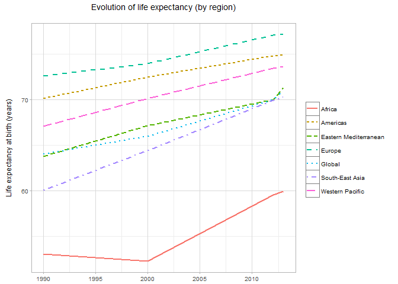

WHO
===

[](http://cran.r-project.org/web/packages/WHO) [](https://travis-ci.org/expersso/WHO) [](https://codecov.io/github/expersso/WHO?branch=master) [](http://cran.r-project.org/web/packages/WHO)

### Introduction

The `WHO` package allows the user to download public health data from the [World Health Organization's](http://www.WHO.int/) [Global Health Observatory](http://www.WHO.int/gho/en/) in a dynamic and reproducible way.

The package can be installed from either CRAN or Github (development version):

``` r
# From CRAN
install.packages("WHO")

# From Github
library(devtools)
install_github("expersso/WHO")

library(WHO)
```

### Usage Example

The `get_codes` function returns a data frame with series codes and descriptions for all available series:

``` r
library(dplyr)
```

    ## 
    ## Attaching package: 'dplyr'

    ## The following objects are masked from 'package:stats':
    ## 
    ##     filter, lag

    ## The following objects are masked from 'package:base':
    ## 
    ##     intersect, setdiff, setequal, union

``` r
codes <- get_codes()
head(codes)
```

    ## Source: local data frame [6 x 3]
    ## 
    ##            label
    ##            (chr)
    ## 1 MDG_0000000001
    ## 2 MDG_0000000003
    ## 3 MDG_0000000005
    ## 4 MDG_0000000006
    ## 5 MDG_0000000007
    ## 6 MDG_0000000010
    ## Variables not shown: display (chr), url (chr)

(To retrieve additional meta information (e.g. French and Spanish descriptions, category breakdowns of series, etc), use `get_codes(extra = TRUE)`.)

To find a series of interest, use either `View(codes)` in Rstudio, or search with regular expressions:

``` r
codes[grepl("[Ll]ife expectancy", codes$display), ]
```

    ## Source: local data frame [3 x 3]
    ## 
    ##           label                                         display
    ##           (chr)                                           (chr)
    ## 1 WHOSIS_000001                Life expectancy at birth (years)
    ## 2 WHOSIS_000002 Healthy life expectancy (HALE) at birth (years)
    ## 3 WHOSIS_000015               Life expectancy at age 60 (years)
    ## Variables not shown: url (chr)

The `codes` data frame also provides a `url` to the meta data for a specified series:

``` r
# Opens a browser with the meta data for the specified series
browseURL(codes$url[1])
```

Having found the series of interest (in the `label` column), we can easily retrieve the data and, for example, make a chart:

``` r
library(ggplot2)

df <- get_data("WHOSIS_000001")

head(df)
```

    ## Source: local data frame [6 x 8]
    ## 
    ##                country                              gho  year
    ##                  (chr)                            (chr) (dbl)
    ## 1              Andorra Life expectancy at birth (years)  1990
    ## 2 United Arab Emirates Life expectancy at birth (years)  2000
    ## 3 United Arab Emirates Life expectancy at birth (years)  1990
    ## 4            Australia Life expectancy at birth (years)  1990
    ## 5            Australia Life expectancy at birth (years)  2012
    ## 6              Belgium Life expectancy at birth (years)  1990
    ## Variables not shown: worldbankincomegroup (chr), region (chr), sex (chr),
    ##   publishstate (chr), value (dbl)

``` r
df %>% 
  filter(sex == "Both sexes") %>% 
  group_by(region, year) %>%
  summarise(value = mean(value)) %>% 
  ggplot(aes(x = year, y = value, color = region, linetype = region)) +
  geom_line(size = 1) +
  theme_light(9) +
  labs(x = NULL, y = "Life expectancy at birth (years)\n", 
       linetype = NULL, color = NULL,
       title = "Evolution of life expectancy (by region)\n")
```



### Disclaimer

This package is in no way officially related to or endorsed by the WHO.
